# To play the game

Run the file 'main.py'
Go up and down to navigate through the different players and press spacebar to start the game

# Controls

## Player 1 Controls

- WASD = Movement
- E = Primary Attack
- R = Heavy Attack
- T = Misc Attack
- F = Blocking

## Player 2 Controls

- Arrows = Movement
- , = Primary Attack
- . = Heavy Attack
- / = Misc Attack
- RShift = Blocking

# All Characters' Movesets

## The Puncher

### Light Attack

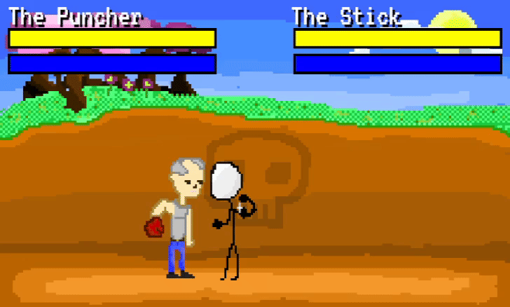

### Heavy Attack

*A powerful punch that takes a while to wind up*
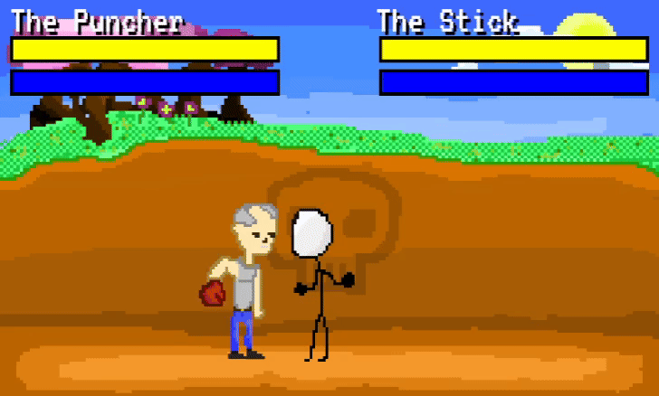

### Misc Attack

*A dashing move to get closer to your opponent*
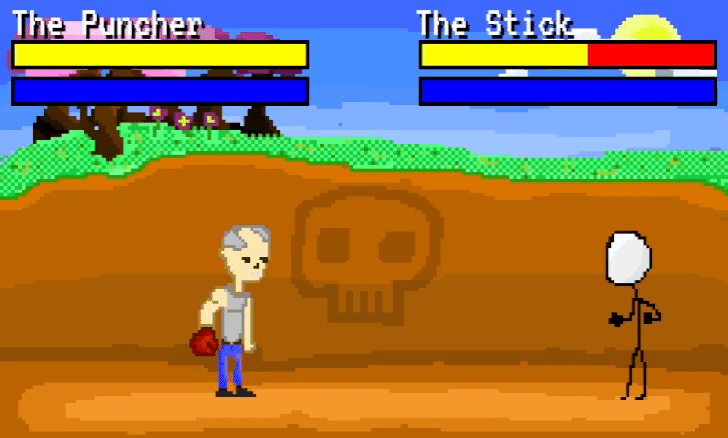

## The Bomber

### Light Attack

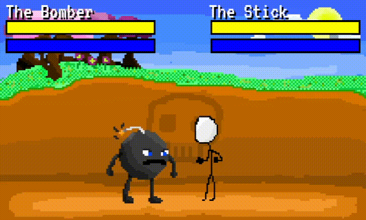

### Heavy Attack

*Sets off an explosive attack that deals huge damage at the cost of your own health*
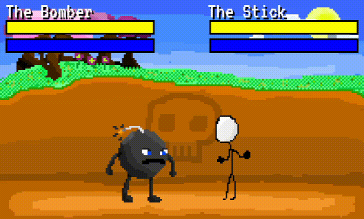

### Misc Attack

*Throws a projectile that acts as a land mine if it doesn't initially hit its opponent*
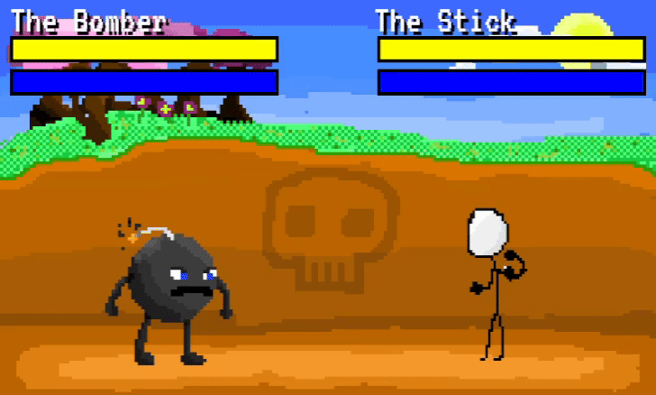

## The Volt

### Light Attack

*Drains the opponent's stamina if it comes into contact*
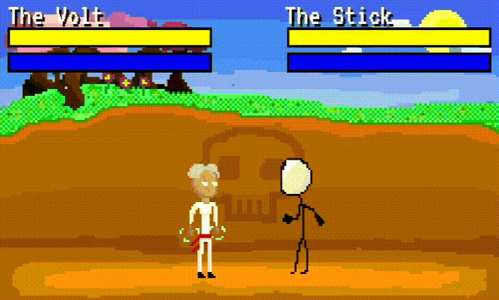

### Heavy Attack

*Throws a lightning bolt that drains a lot of stamina if it comes into contact*
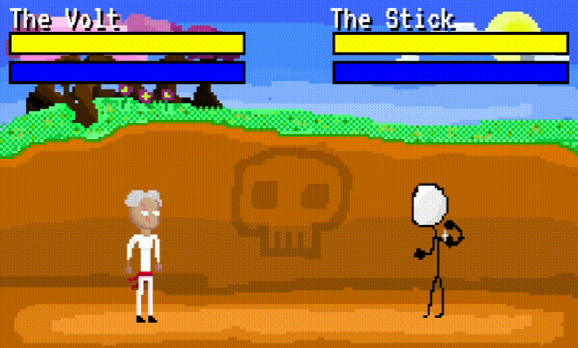

### Misc Attack

*Exchanges its own HP for more stamina*
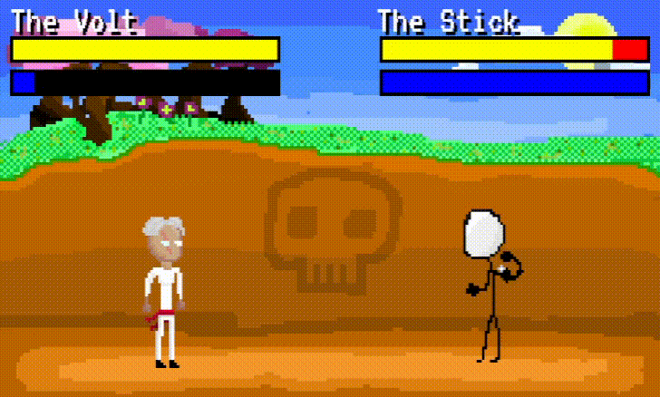

## The Transformer

### Light Attack

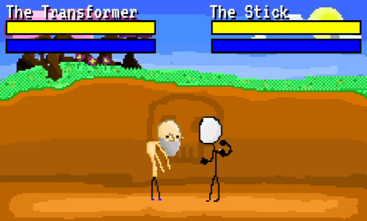

### Heavy Attack

*Transforms into its car form and charges forward*
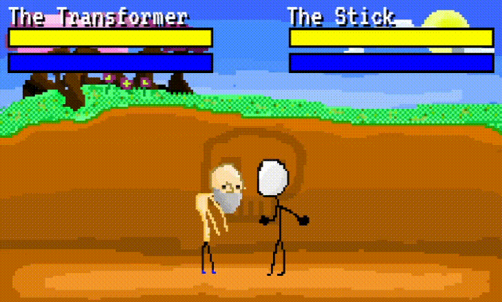

### Misc Attack

*Transforms into its car form permanently until it gets hit, does its heavy attack or you transform it back*
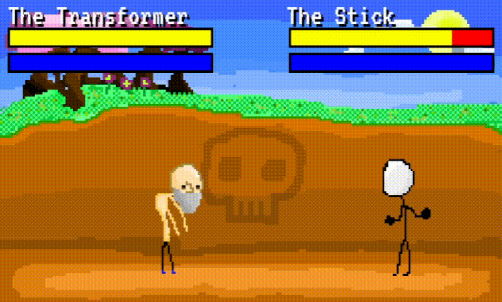

### Light Attack (Transformed)

*Heals a portion of their HP back*
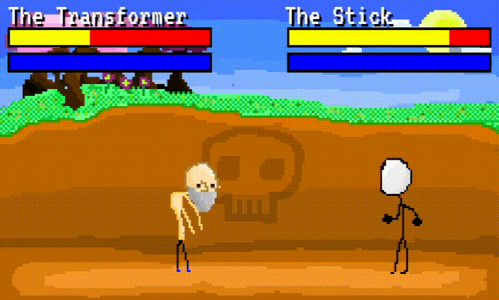

### Heavy Attack (Transformed)

*A more powered charge that deals more damage and traverses most of the screen*
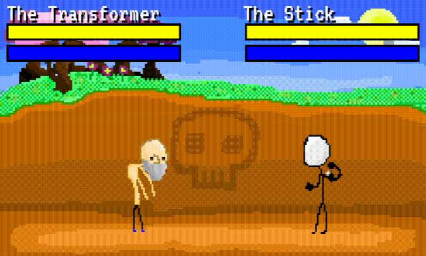

## The Stick

### Light Attack

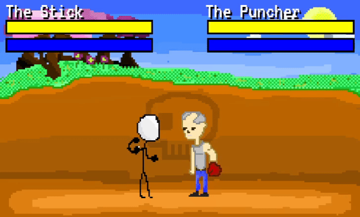

### Heavy Attack

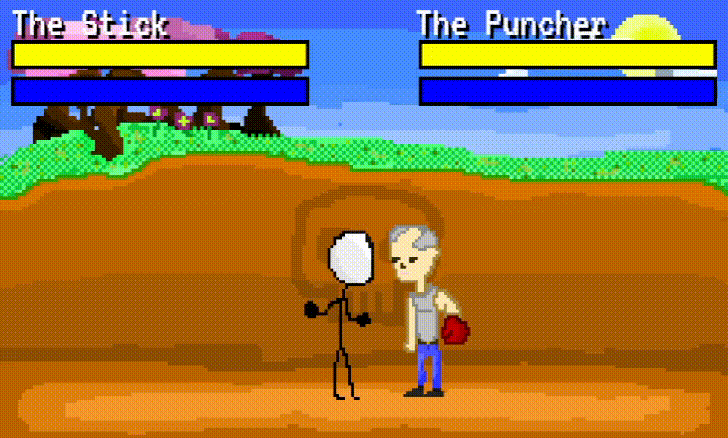

### Misc Attack

*The player can transform into **The Stick Avatar** when they're below 30% health. In this form, they move and regenerate stamina faster*
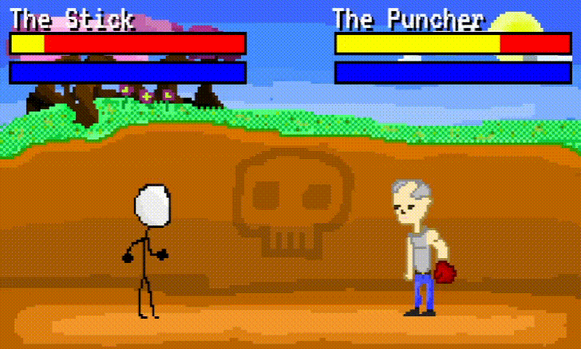

### Light Attack (Transformed)

*Its light attack is rapid fast compared to its normal form*
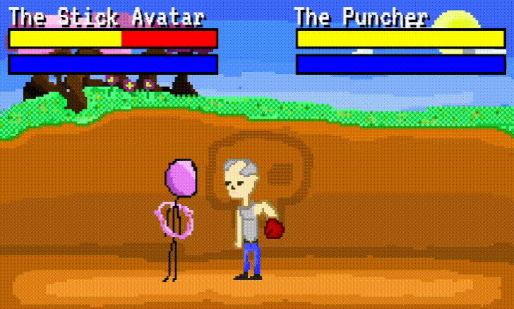

### Heavy Attack (Transformed)

*If the down key is not pressed at the same time, the player will teleport in front of the player. Else, it will go to the opposite side of the screen*
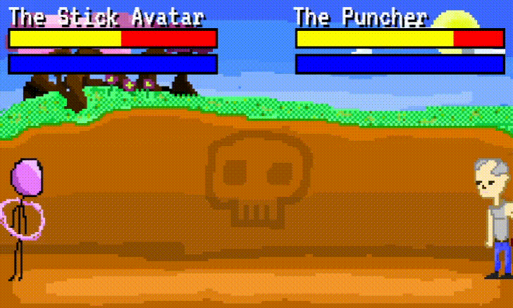
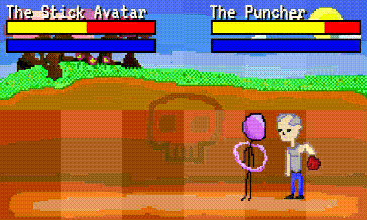

### Misc Attack (Transformed)

*Throws a rapid projectile*
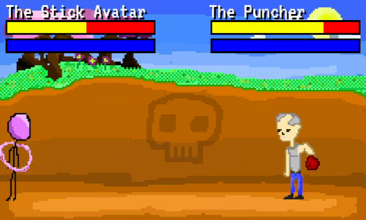
